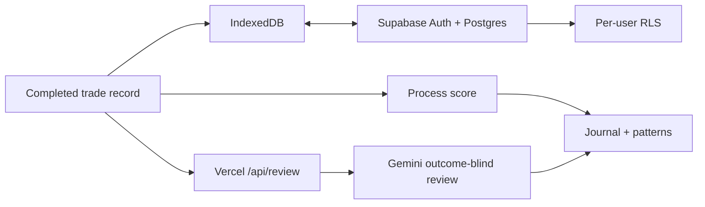

# ProcessAlpha

**An outcome-blind trading decision journal and AI process coach.**

[Open the product](https://processalpha.vercel.app) · [Launch the journal](https://processalpha.vercel.app/app) · [System health](https://processalpha.vercel.app/api/health)

ProcessAlpha helps traders evaluate how they made a decision instead of letting the eventual profit or loss rewrite the story. It records the original thesis and invalidation condition, calculates a deterministic process score, finds repeated rule violations, and asks Gemini for outcome-blind coaching.

## Why it exists

A profitable trade can come from a poor process, while a disciplined decision can still lose money. Most journals mix those signals. ProcessAlpha keeps them separate so users can improve repeatable behaviour instead of optimizing for hindsight.

## What is live

- Local-first IndexedDB journal that works without an account.
- Deterministic scoring from four pre-committed process checks.
- Gemini 3.6 Flash review that never receives prices or realized P&L.
- Pattern detection across recorded decisions.
- Passwordless Supabase authentication and cross-device synchronization.
- JSON export for user-controlled portability.

## Architecture



Saving is local-first: the record is persisted before any model request, so an AI outage cannot lose it. When a user signs in, local records are merged into the authenticated account. Supabase row-level security limits every cloud record to its owner.

## Run locally

Requirements: Node.js 22 and the [Vercel CLI](https://vercel.com/docs/cli).

```bash
git clone https://github.com/ezekiel6262/processalpha.git
cd processalpha
npm install
cp .env.example .env.local
vercel dev
```

`GEMINI_API_KEY` is required for AI review. Supabase variables are optional for local-only use; add them to enable authentication and cloud synchronization.

To apply the included schema to a development Supabase project:

```bash
npm run migrate
```

This requires `SUPABASE_DB_URL`. Use a development database and review the migration first.

## Environment variables

| Variable | Scope | Purpose |
| --- | --- | --- |
| `GEMINI_API_KEY` | Server only | Outcome-blind Gemini review |
| `NEXT_PUBLIC_SUPABASE_URL` | Public | Project URL returned by `/api/config` |
| `NEXT_PUBLIC_SUPABASE_PUBLISHABLE_KEY` | Public | Restricted browser client key |
| `SUPABASE_DB_URL` | Local migration only | Postgres connection for `npm run migrate` |

Never place a Supabase service-role key or database URL in browser code.

## Repository map

```text
api/review.js        privacy-filtered Gemini process review
api/config.js        safe public cloud configuration
api/health.js        deployment readiness endpoint
api/_lib/security.js validation, throttling, timeouts, response helpers
dist/index.html      public product homepage
dist/app.html        local-first journal workspace
supabase/migrations  versioned schema and RLS policies
scripts/migrate.mjs  explicit database migration runner
vercel.json          function limits and security headers
```

## Privacy and safety

- Entry price, exit price, and P&L are excluded from the model request.
- Unsigned records remain in the browser unless the user exports them.
- Signed-in records use ownership-based Postgres row-level security.
- Journal writes complete before AI review begins.
- Structured model output prevents arbitrary UI content.
- The product provides process reflection, not trading instructions or financial advice.

## Limitations

ProcessAlpha does not execute trades, connect to an exchange account, or verify whether a narrative was truly written before entry. Pattern quality depends on the number and honesty of recorded decisions. Email delivery and cloud availability depend on configured Supabase services.

## License

Released under the [MIT License](LICENSE).
